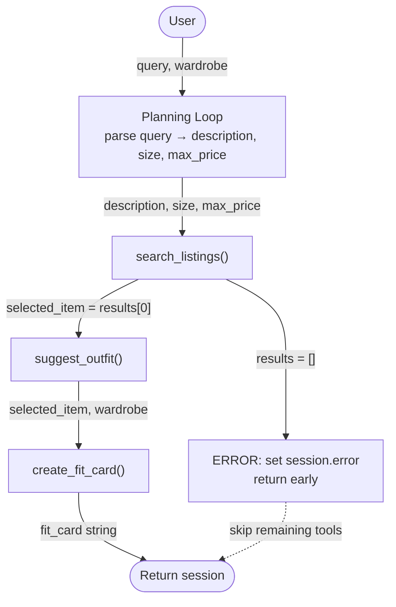

# FitFindr — planning.md

> Complete this document before writing any implementation code.
> Your spec and agent diagram are what you'll use to direct AI tools (Claude, Copilot, etc.) to generate your implementation — the more specific they are, the more useful the generated code will be.
> Your planning.md will be reviewed as part of your submission.
> Update it before starting any stretch features.

---

## Tools

List every tool your agent will use. For each tool, fill in all four fields.
You must have at least 3 tools. The three required tools are listed — add any additional tools below them.

### Tool 1: search_listings

**What it does:** This tool searches the listings dataset for items matching the description, optional size, and optional price.
It returns a list of dicts for each listing that matches, and returns an empty list if no matches were found.
<!-- Describe what this tool does in 1–2 sentences -->

**Input parameters:**
<!-- List each parameter, its type, and what it represents -->
- `description` (str): Represents the keywords describing what type of clothing the user is looking for 
- `size` (str): Represents the size that the user is looking for; size filtering is optional, so it's up to the user to give a size
- `max_price` (float): Represents the max price that the user is willing to pay for a listing; this is also optional, so it's up to the user to give a price

**What it returns:** This tool returns a list of dicts for each listing that matches, sorted by relevance (best match first). If no matches are found, an empty list is returned. Each dict in the list contains the following fields: id, title, description, category, style_tags (list), size, condition, price (float), colors (list), brand, platform
<!-- Describe the return value — what fields does a result contain? -->

**What happens if it fails or returns nothing:** If no listings match, the tool returns an empty list. It does not raise an exception
<!-- What should the agent do if no listings match? -->

---

### Tool 2: suggest_outfit

**What it does:** This tool takes a thrifted item and the user's current wardrobe to suggest 1-2 new complete outfits.
<!-- Describe what this tool does in 1–2 sentences -->

**Input parameters:**
<!-- List each parameter, its type, and what it represents -->
- `new_item` (dict): This represents the listing dict of the thrifted item the user is considering buying
- `wardrobe` (dict): This represents the wardrobe dict with an 'items' key containing a list of wardrobe item dicts (i.e., all of the clothes the user has in their wardrobe)

**What it returns:** The tool returns a non-empty string with outfit suggestions
<!-- Describe the return value -->

**What happens if it fails or returns nothing:**  If the user's wardrobe is empty, the tool instead offers general styling advice for the thrifted item being considered
<!-- What should the agent do if the wardrobe is empty or no outfit can be suggested? -->

---

### Tool 3: create_fit_card

**What it does:** Using an outfit suggestion (derived from `suggest_outfit`) and the listing dict for the newly thrifted item, the tool generates a short, shareable outfit caption for the find.
<!-- Describe what this tool does in 1–2 sentences -->

**Input parameters:** 
<!-- List each parameter, its type, and what it represents -->
- `outfit` (str): This represents the outfit suggestion string from `suggest_outfit()`
- `new_item` (dict): This represents the listing dict for the thrifted item

**What it returns:** THe tool returns a 2-4 sentence string usable as an Instagram/TikTok caption.
<!-- Describe the return value -->

**What happens if it fails or returns nothing:** If the outfit is empty or missing, return a descriptive error message string. Do not raise an exception.
<!-- What should the agent do if the outfit data is incomplete? -->

---

### Additional Tools (if any)

<!-- Copy the block above for any tools beyond the required three -->

---

## Planning Loop

**How does your agent decide which tool to call next?**
<!-- Describe the logic your planning loop uses. What does it look at? What conditions change its behavior? How does it know when it's done? -->

`run_agent(query, wardrobe)` executes a fixed linear sequence with one early-exit branch. There is no dynamic tool selection; the order is always parse -> search -> suggest -> caption, unless search returns nothing.

**Step 1 — Initialize session**
Call `_new_session(query, wardrobe)` to create the session dict. All output fields (`search_results`, `selected_item`, `outfit_suggestion`, `fit_card`, `error`) start as empty/None.

**Step 2 — Parse the query**
Extract three values from `query` using regex:
- `description`: the full query string with price and size tokens stripped (e.g. `"vintage graphic tee"`)
- `size`: the first match of a size pattern like `size [XS|S|M|L|XL|XXS|XXL|\d+]`, case-insensitive; `None` if not found
- `max_price`: the first dollar amount found (e.g. `$30` -> `30.0`); `None` if not found

Store all three in `session["parsed"]` as `{"description": ..., "size": ..., "max_price": ...}`.

**Step 3 — Call `search_listings` and branch on results**
Call `search_listings(session["parsed"]["description"], session["parsed"].get("size"), session["parsed"].get("max_price"))` and store the return value in `session["search_results"]`.

- **If `session["search_results"]` is an empty list:** set `session["error"]` to a helpful message such as `"No listings matched your search. Try broader keywords, remove the size filter, or raise your price limit."` then immediately `return session`. Do NOT call `suggest_outfit` or `create_fit_card`.
- **If `session["search_results"]` is non-empty:** set `session["selected_item"] = session["search_results"][0]` (the highest-relevance result) and continue to Step 4.

**Step 4 — Call `suggest_outfit`**
Call `suggest_outfit(session["selected_item"], session["wardrobe"])` and store the returned string in `session["outfit_suggestion"]`. No early-exit branch here, `suggest_outfit` handles an empty wardrobe internally by returning general styling advice instead of raising.

**Step 5 — Call `create_fit_card`**
Call `create_fit_card(session["outfit_suggestion"], session["selected_item"])` and store the returned string in `session["fit_card"]`. No early-exit branch here — `create_fit_card` handles a missing/empty outfit string by returning a descriptive error message string instead of raising.

**Step 6 — Return session**
Return the completed session dict. The caller checks `session["error"]` first; if it is `None`, all three output fields (`selected_item`, `outfit_suggestion`, `fit_card`) are populated.

**The agent is done** after Step 6. It does not loop or retry. Each run processes exactly one query.
---

## State Management

**How does information from one tool get passed to the next?**
<!-- Describe how your agent stores and accesses state within a session. What data is tracked? How is it passed between tool calls? -->

---

## Error Handling

For each tool, describe the specific failure mode you're handling and what the agent does in response.

| Tool | Failure mode | Agent response |
|------|-------------|----------------|
| search_listings | No results match the query | Return an empty list (but don't raise an exception). |
| suggest_outfit | Wardrobe is empty | Offer general styling advice for the item rather than raising an exception or returning an empty string. |
| create_fit_card | Outfit input is missing or incomplete | Return a descriptive error message, but don't raise an exception. |

---

## Architecture

---

## AI Tool Plan

<!-- For each part of the implementation below, describe:
     - Which AI tool you plan to use (Claude, Copilot, ChatGPT, etc.)
     - What you'll give it as input (which sections of this planning.md, your agent diagram)
     - What you expect it to produce
     - How you'll verify the output matches your spec before moving on

     "I'll use AI to help me code" is not a plan.
     "I'll give Claude my Tool 1 spec (inputs, return value, failure mode) and ask it to implement
     search_listings() using load_listings() from the data loader — then test it against 3 queries
     before trusting it" is a plan. -->

**Milestone 3 — Individual tool implementations:**

**Milestone 4 — Planning loop and state management:**

---

## A Complete Interaction (Step by Step)

Write out what a full user interaction looks like from start to finish — tool call by tool call. Use a specific example query.

**Example user query:** "I'm looking for a vintage graphic tee under $30. I mostly wear baggy jeans and chunky sneakers. What's out there and how would I style it?"

**Step 1:** Search: `search_listings("vintage graphic tee", size="M", max_price=30.0)` returns 3 matching listings sorted by relevance. FitFindr picks the top result: "Faded Band Tee - $22, Depop, Good condition."
<!-- What does the agent do first? Which tool is called? With what input? -->

**Step 2:** A listing dict of the new item is returned from Step 1, and no we use it to suggest a new outfit: `suggest_outfit(new_item=<band tee>, wardrobe=<user's wardrobe>)`. This returns an outfit suggestion in string form: "Pair this with your wide-leg jeans and platform Docs for a classic 90s grunge look. Roll the sleeves once and tuck the front corner slightly for shape."
<!-- What happens next? What was returned from step 1? What tool is called now? -->

**Step 3:** Given the new listing dict from Step 1, and now the outfit suggestion output from Step 2, we use both of these to generate an outfit caption for the new find: `create_fit_card(outfit=<suggestion>, new_item=<band tee>)`. This returns an outfit caption in string form: "thrifted this faded band tee off depop for $22 and honestly it was made for my wide-legs <3 full look in my stories"
<!-- Continue until the full interaction is complete -->

**Error path:** If `search_listings` returns nothing, FitFindr tells the user what to try differently and stops, it does not call `suggest_outfit` with empty input.

**Final output to user:** The final outputs to the user are: listings for clothes that match the user's description of what they're looking for, outfit suggestions for those new clothes, and captions for those outfits for when the user wants to post them on social media
<!-- What does the user actually see at the end? -->
